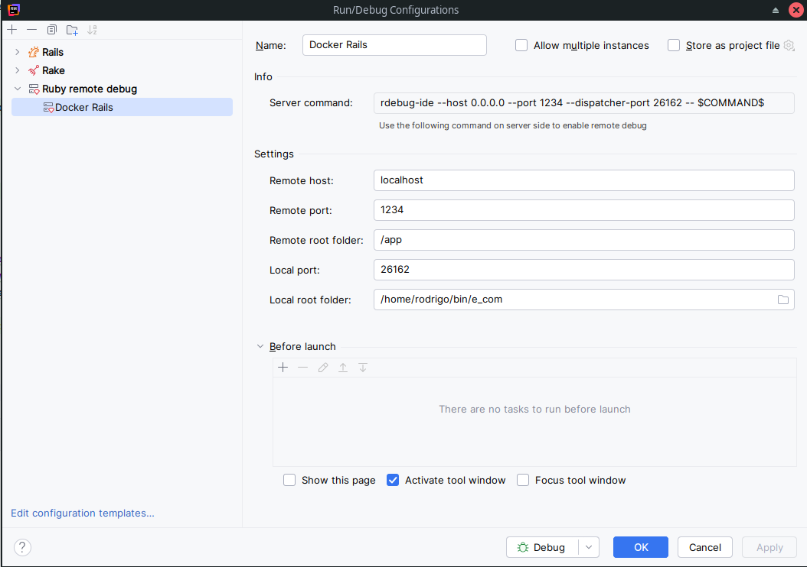
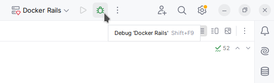

# ECom
# 1. Ejecución
## 1.1 Ejecución Docker
Se recomienda ejecutar en un contenedor Docker. Esto evita tener que instalar y configurar manualmente la BD, Ruby, etc.

**Pre-requisitos**
- Docker
- Docker Compose

La configuración de Docker Compose fue probada en la distribución ArchLinux.

Iniciar la aplicación
````sh
$ docker-compose up dev
````
Acceder a http://localhost:3000

Ctrl + c para detener la aplicación en la Terminal.


También se puede iniciar la aplicación en segundo plano
````sh
$ docker-compose up dev -d
````

En este caso la aplicación se detiene con
````sh
$ docker-compose down
````

## 1.2 Ejecución Local
**Pre-requisitos**
- Ruby 1.9.3
- PostgreSQL 9.6
- Redis

Ubicarse en el directorio del proyecto Rails e instalar las gemas
````sh
$ bundle install
````
Crear el usuario de base de datos en PostgreSQL
````sh
$ sudo su postgres
$ psql
postgres=# create role e_com with CREATEDB SUPERUSER login password 'e_com';
postgres=# \q
$ exit
````

Iniciar la base de datos, ejecutar migraciones y seed.
````sh
$ rake db:setup
````

Iniciar la aplicación
````sh
$ rails s
````
Acceder a http://localhost:3000

# 2. Testing
## 2.1 Testing Docker
Ejecutar los tests
````sh
$ docker-compose up test
````

## 2.2 Testing Local
Ejecutar los tests
````sh
$ rake spec
````

# 3. Depuración
## 3.1. Depuración Rubymine
Habilitar el comando de depuración en docker-compose
````yml
command: rdebug-ide --host 0.0.0.0 --port 1234 --dispatcher-port 26162 -- script/rails s -b 0.0.0.0
````

Agregar una configuración de depuración remota en Rubymine


- `Remote host`: Es localhost porque se expuso el puerto 1234 al host local a través en docker-compose
- `Remote port`: El port indicado al comando rdebug-ide
- `Remote root folder`: La ubicación en donde está el código fuente dentro del contenedor, esta ubicación está definida en docker-compose
- `Local port`: El dispatcher-port indicado al comando rdebug-ide
- `Local root folder`: La ubicación del código fuente en el host

Iniciar la aplicación desde la terminal
````sh
$ docker-compose up test
````

Ejecutar "Debug Docker Rails" en Rubymine



# 4. Comandos Útiles
Iniciar e ingresar al contenedor sin ejecutar rails s por defecto. Útil para resetear la base de datos.
Con --rm el contenedor desaparece al salir del mismo.
````sh
$ docker-compose run --rm dev /bin/bash
````
